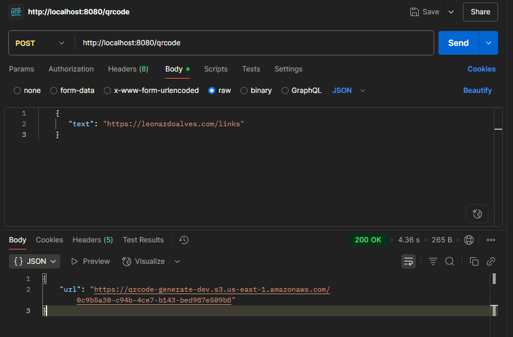
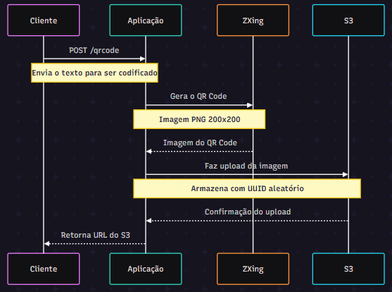

# Gerador de QR Code  

  

Esta é uma aplicação Spring Boot que gera códigos QR personalizados utilizando a biblioteca ZXing, uma ferramenta open source do Google para criação e leitura de códigos de barras e QR Codes. Após a geração, os códigos são automaticamente armazenados no Amazon S3, um serviço de armazenamento na nuvem altamente escalável e seguro da AWS. Este projeto demonstra como integrar de forma eficiente o ZXing para criação de QR Codes e o AWS S3 para armazenamento e gerenciamento confiável dos arquivos gerados, possibilitando o acesso fácil e a distribuição dos códigos QR pela nuvem.

---

## 🛠️ Pré-requisitos

- Java 21 JDK  
- Maven  
- Docker  
- Conta AWS com acesso ao S3  
- AWS CLI configurado com credenciais apropriadas  

---

## 🔐 Variáveis de Ambiente

Crie um arquivo `.env` na raiz do projeto com as seguintes variáveis:

```
AWS_ACCESS_KEY_ID=sua_chave_de_acesso
AWS_SECRET_ACCESS_KEY=sua_chave_secreta
AWS_REGION=sua_região
AWS_BUCKET_NAME=nome_do_seu_bucket
```

---

## 🚀 Executando a Aplicação

### Desenvolvimento Local

1. Crie o arquivo `.env` conforme descrito acima  
2. Compile o projeto:  
   ```bash
   mvn clean package
   ```  
3. Execute a aplicação:  
   ```bash
   mvn spring-boot:run
   ```

### 🐳 Implantação com Docker

1. Construa a imagem Docker:  
   ```bash
   docker build -t qrcode-generator:X.X .
   ```  
   *Substitua `X.X` pela versão e nome da imagem desejada.*

2. Execute o container:  
   ```bash
   docker run --env-file .env -p 8080:8080 qrcode-generator:X.X
   ```  
   *Certifique-se de que o caminho para o arquivo `.env` está correto.*

---

## ⚙️ Configuração do AWS S3

- Crie um bucket S3 na sua conta AWS  
- Atualize a variável `AWS_BUCKET_NAME` no arquivo `.env` ou no comando Docker run  
- Garanta que suas credenciais AWS tenham permissões adequadas para acessar o bucket S3  

---

## 📊 Fluxo da Aplicação



> Nota: Este diagrama foi criado no [Mermaid Online Editor](https://www.mermaidchart.com).


---

## 🔗 Endpoints da API


### POST `/qrcode`

Gera um código QR a partir do texto fornecido e armazena no AWS S3. O QR Code será gerado como uma imagem PNG com dimensões 200x200 pixels.

**Parâmetros**

| Nome | Obrigatório | Tipo   | Descrição                                  |
|-------|-------------|--------|--------------------------------------------|
| text  | sim         | string | O texto que será codificado no QR Code. Pode ser qualquer string. |

**Resposta**

```json
{
  "url": "https://seu-bucket.s3.sua-regiao.amazonaws.com/uuid-aleatorio"
}
```

**❌ Resposta de Erro**

- Retorna `500 Internal Server Error` caso ocorra erro na geração do QR Code ou no upload para o S3.

**Exemplo de Uso**

```bash
curl -X POST http://localhost:8080/qrcode \
     -H "Content-Type: application/json" \
     -d '{"text": "https://exemplo.com"}'
```
---

Projeto desenvolvido por **Leonardo Alves**, inspirado no repositório da [Fernanda Kipper](https://github.com/Fernanda-Kipper/grcode-generator).

---


